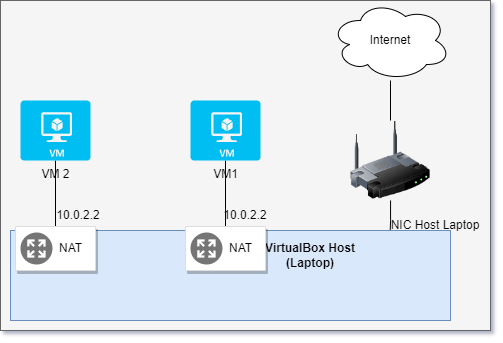

# Vagrant
Vagrant kann man [hier](https://www.vagrantup.com/downloads) downloaden und installieren.

## Erste VM mit Vagrant erstellen
1. Als erstes muss ein VM Verzeichnis erstellt werden. Hier z.B. ```Ubuntu 2204Server```. Danach in dieses Verzeichnis navigieren. (Natürlich alles in der Powershell oder unter Linux in der Bash)

2. Mit folgendem Befehl kann ein sogenanntes ```Vagrantfile``` von der jeweiligen Vagrant Box erstellt werden. Vagrant Boxen sind wie eine Art vorgefertigte VM Templates.
    ```bash
    vagrant init ubuntu/xenial64
    ```
    ```ubuntu/xeniial64``` ist in diesem Fall die eben genannte Vagrant Box. Man findet diese auch auf der [Vagrant Cloud](https://app.vagrantup.com/boxes/search)

3. Mit ```vagrant up``` kann man nun den Erstellprozess starten. Dann wird die Box/Image von dem Internet heruntergeladen (falls sie nicht schon lokal vorhanden ist) und eine VM erstellt. Dabei werden die ganzen Konfigurationen im Vagrantfile berücksichtigt.
    ```bash
    vagrant up --provider virtualbox
    ```
    mit ```--provider virtualbox``` kann noch angegeben werden, dass Vagrant Virtualbox nutzen soll. Denn Vagrant unterstützt auch noch andere Provider wie z.B. Vmware und Hyper-V.

4. Mit ```vagrant ssh``` kann man sich nun auf die VM verbinden.
    ```bash
    vagrant ssh
    ```

5. Hier noch die wichtigsten Befehle zu Vagrant, auch wie man die VM anhält oder auch wieder löscht.

    | Befehl               | Beschreibung                                           |
    |----------------------|--------------------------------------------------------|
    | `vagrant up`         | Startet und provisioniert eine neue virtuelle Maschine |
    | `vagrant ssh`        | Verbindet sich per SSH zur laufenden VM                |
    | `vagrant halt`       | Stoppt die laufende VM                                  |
    | `vagrant destroy`    | Löscht die VM und alle zugehörigen Ressourcen          |
    | `vagrant status`     | Zeigt den Status aller VMs im aktuellen Verzeichnis an |
    | `vagrant init`       | Initialisiert ein neues Vagrant-Projekt im Verzeichnis  |
    | `vagrant reload`     | Neustartet die VM und lädt die Vagrant-Konfiguration    |
    | `vagrant suspend`    | Pausiert die laufende VM                                |
    | `vagrant resume`     | Nimmt eine pausierte VM wieder auf                      |
    | `vagrant provision`  | Führt eine erneute Provisionierung auf der VM durch     |

6. Hier ein Netzwerkplan der darstellt wie das Netzwerktechnisch mit den VMs funktioniert.
   
