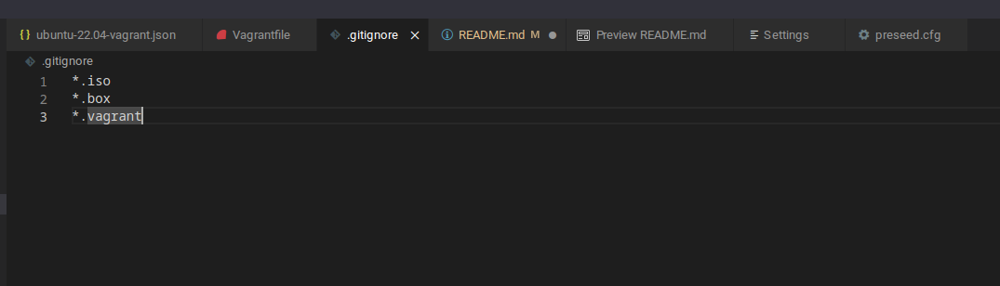

# M300-Services

## Github Versionsverwaltung auf dem PC einrichten
Um vom PC Dateien auf Github hoch und runterzuladen braucht man den Git Client auf dem lokalen PC. Dieser kann man hier herunterladen. [Git Download](https://git-scm.com/downloads)

1. Als erstes muss ein SSH Key erstellt werden. Somit haben wir vom lokalen PC Zugriff auf das Github Repository. Mit folgendem Befehl kann ganz einfach ein solcher Key erstellt werden.
    ```bash
    ssh-keygen -t rsa -b 4096 -C "beispiel@beispiel.com"
    ```

2. Nun müssen wir den Key in unserem Github Konto hinzufügen. Dazu bei Github auf Einstellungen und dann unter ```SSH and GPG keys``` denn Key hinterlegen. Den Key findet man in der eben erstellten Datei ```id_rsa.pub```. Diese liegt bei Default im Verzeichnis ```%HOME%/.ssh/id_rsa.pub```.


3. Nun muss noch Git mit zwei Informationen gefüttert werden. Dies mit folgenden Befehlen.
    ```bash
    git config --global user.name "<username>"
    git config --global user.email "<e-mail>"
    ```

4. Das war es eigentlich auch schon. Nun kann man mit dem Git Befehl Repositories pullen, pushen und noch vieles mehr. Hier mal die wichtigsten Befehle.

    | Befehl        | Beschreibung                                              |
    |---------------|-----------------------------------------------------------|
    | `git init`    | Erstellt ein neues Git-Repository im aktuellen Verzeichnis |
    | `git add`     | Fügt Änderungen zum Staging-Bereich hinzu                  |
    | `git commit`  | Speichert Änderungen im Repository                        |
    | `git clone`   | Erstellt eine Kopie eines Remote-Repositories              |
    | `git pull`    | Aktualisiert lokale Änderungen mit den neuesten Änderungen |
    | `git push`    | Überträgt lokale Änderungen an ein Remote-Repository       |
    | `git branch`  | Erstellt, löscht oder zeigt Branches im Repository an      |
    | `git merge`   | Führt zwei oder mehr Branches zusammen                     |
    | `git status`  | Zeigt den Status der Arbeitskopie und des Repositories an  |
    | `git log`     | Zeigt die Versionsgeschichte an                            |


## Dateien ausschliessen vom Upload zu Github
Um Dateien auszuschliessen, damit diese nicht auf Github hochgeladen werden, muss eine Datei namens ```.gitignore``` erstellt werden. In diese ".gitignore" Datei kann man Dateien, Ordner und Dateiendungen reinschreiben, diese ignoriert werden sollt und somit nicht auf Github hochgeladen werden. Ich habe hier alle .iso, .box und .vagrant Dateien/Ordner reingeschrieben.


Hier noch diverse Beispiele: [Link](https://gist.github.com/octocat/9257657)

