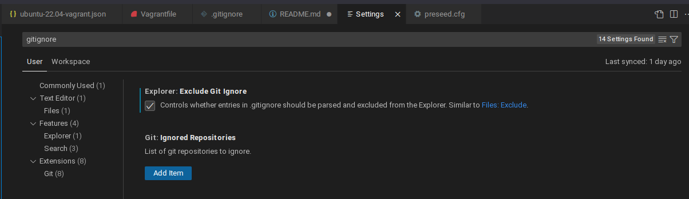
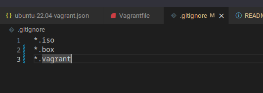

# M300-Services

Exclude Files from Upload to Github:
1. In den Einstellungen von VisualCode nach "gitignore" suchen und den Haken bei "Explorer: Exclude Git Ignore". Somit wird im Haupt Repository Verzeichnis eine ".gitignore" Datei erstellt.

2. In diese ".gitignore" Datei kann man Dateien, Ordner und Dateiendungen reinschreiben, diese ignoriert werden sollt und somit nicht auf Github hochgeladen werden. Ich habe hier alle .iso, .box und .vagrant Dateien/Ordner reingeschrieben.

Hier noch diverse Beispiele: [Link](https://gist.github.com/octocat/9257657)